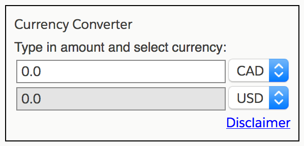
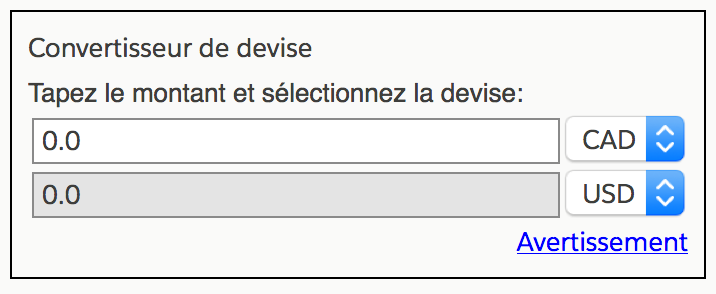

# Currency Converter

The Fx Conversion Application was developed using **Angular 5.1.2**

The demo Application shows how to:

- Code a reusable currency converter component.
- Use **HttpClient** and handle errors gracefully.
- Input validation.
- Support i18n language translation (English, French for demo).

## Bonus

1. Create a Feature **NgModule**.
    - Reusable Service class.
    - Reusable Component.
1. Test Service with a mock.
1. Test Component with **sync** and **async** operations.
1. Language translation using Angular I18n support.

### English



### French



## Features

- Responsive design using **Lightning Design System**.
- Angular i18n language translation.
- You can type in a value and see live updates for the converted amount.
- The default currencies are CAD and USD.
  - You may change the currency to: CAD, USD, EUR.
- Input validation and error User messaging is provided.
- Currency conversion values is fetched using HTTP.
- HTTP and network error checking is supported.
  - Will retry 3 times before giving up temporarily.
  - Main application (Component) refreshes currency values every minute from exchange.
  - Rate update is done in life-cycle hooks using **Observable** timer.
- Converted value is rounded to 2 decimal places.
- Design pattern: Uses Angular Service to fetch FX rates and provide a conversion API.

## Additional notes

- This is a Angular CLI generated app, Webpack is supported out of the box.
- Uses SCSS for Style Sheets, which are co-located with the Component.
- Uses Typescript (ES6).
- NPM Package manager via **package.json**.

## Running the sample code

To run the sample Application, from the project folder type:

```sh
npm install
ng serve --open
```

To run application for the French language, use:

```sh
ng serve --aot --i18nFile=src/locale/messages.fr.xlf --i18nFormat=xlf --locale=fr
```

This should open a Web-browser to **http://localhost:4200/**

## Production Building

To create a build, type:

```sh
ng build --prod
```

To further reduce bundle size, do a optimized build.

```sh
ng build --prod --build-optimizer
```

The build output is found in the "**dist**" folder, which is what you will deploy.

## Testing

Test verified to work with the following Web-browsers.

- Chrome (Version 63.0.3239.84)
- Firefox Developer Ed (58.0b11 64-bit)
- Safari (Version 11.0.2)

```sh
npm test
```

The build artifacts will be stored in the "**dist/**" directory.

## Further help

To get more help on the Angular CLI use "**ng help**" or go check out the [Angular CLI README](https://github.com/angular/angular-cli/blob/master/README.md).
